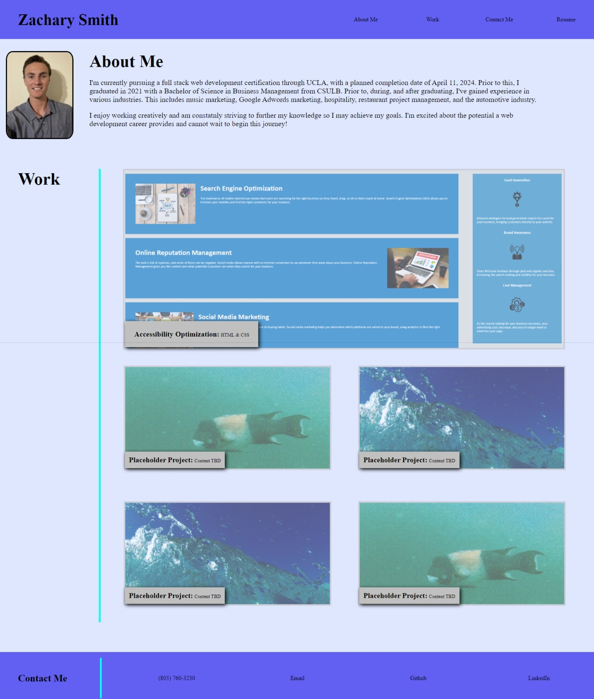

# Zach's Portfolio

## Installation

N/A

## Usage

This portflio can be accessed through the following link: https://smithz852.github.io/portfolio/

Link to GitHub repo: https://github.com/smithz852/portfolio.git

This website can be navigated by either scrolling up and down, or jumping to specific sections via the links provided at the top of the page. The link labeled "Resume" will open a seperate tab with a PDF of the resume. Clicking the "Contact Me" button, or scrolling to the bottom section where it is located, will provide further links, and the ability to call or email me through the respective buttons.

The work section contains pictures of my past projects, as well as breif descriptions, and which types of code were involved in these projects. Simply click on the images to be taken to another page to view the prpjects in more depth. Button pictures are either screenshots of projects or from my personal photo collection.

Webpage Screenshot:

## References

 (n.d.). Setting an image button in CSS - image:active. Stack Overflow. https://stackoverflow.com/questions/12543697/setting-an-image-button-in-css-imageactive 

 W3Schools online HTML editor. W3Schools Online Web Tutorials. (n.d.). https://www.w3schools.com/css/tryit.asp?filename=trycss_buttons_fade+%28.myButton%3A+hover%29+%2A%2F 

 ## Licenses

 MIT License